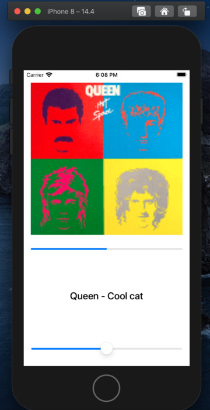
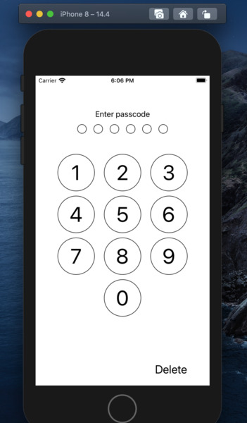
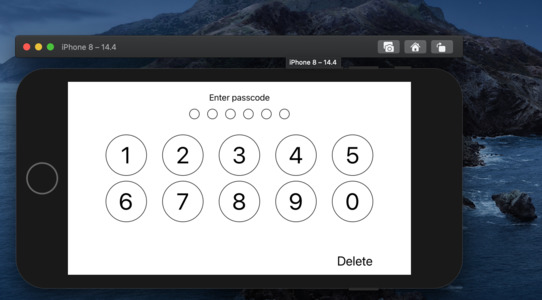

# AutoLayout_Portrait-Album-orientation
Пример верстки аудио плеера и экрана блокировки в портретной и альбомной ориентации с использованием constraints и Stack View

1) Аудио плеер

  Плеер в портретной ориентации
  
  
  
  Плеер в альбомной ориентации
  
   
  
2) Экран блокировки

  В портретной ориентации
  
   
   
  В албомной ориентации
  
  
